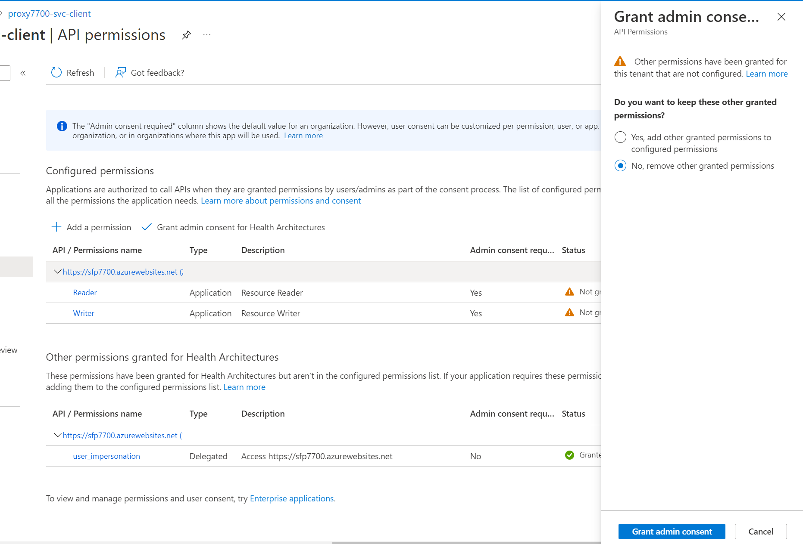

## Sample script execution 

dale@Azure:~/fhir-proxy/scripts$ ./createproxyserviceclient.bash
Executing ./createproxyserviceclient.bash...
Note: You must be authenticated to the same tenant as the proxy server
Checking Azure Authentication...

Collecting Script Parameters

Enter keyvault name that contains the fhir proxy configuration: 
fhir7700kv  
Checking for keyvault fhir7700kv...  
Enter a name for this service client [fhirProxy-svc-client26487]: 
proxy7700-svc-client  
Do you want to store the service client fhirProxy-svc-client26487 credentials in the keyvault fhir7700kv? [y/n]:
y  
Do you want to generate a Postman Environment ? [y/n]:
y  
Starting deployment of... ./createproxyserviceclient.bash -k fhir7700kv -n proxy7700-svc-client -s yes -p yes  
  
Press Enter to continue, or Ctrl+C to exit  
  
Creating Service Client Principal proxy7700-svc-client...  
  
Loading configuration settings from key vault fhir7700kv...  
  
Creating FHIR Proxy Client Service Principal for AAD Auth  
  
WARNING: In a future release, this command will NOT create a 'Contributor' role assignment by default. If needed, use the --role argument to explicitly create a roleassignment.  
  
WARNING: Creating 'Contributor' role assignment under scope '/subscriptions/de91991f-4607-4d0e-80fc-66a33f4e1681'  
  
WARNING: The output includes credentials that you must protect. Be sure that you do not include these credentials in your code or check the credentials into your source control.     For more information, see https://aka.ms/azadsp-cli  
  
WARNING: 'name' property in the output is deprecated and will be removed in the future. Use 'appId' instead.     
WARNING: Invoking "az ad app permission grant --id f768484f-bb9b-40b3-a95f-aaf0a9853736 --api ef4999b2-8376-4f1e-8869-bc1add28cb16" is needed to make the change effective     
Updating Keyvault with new Service Client Settings...     
Generating Postman environment for proxy access...  

************************************************************************************************************
Created fhir proxy service principal client proxy7700-svc-client on Mon 15 Nov 2021 05:15:19 PM UTC  
This client can be used for OAuth2 client_credentials flow authentication to the FHIR Proxy  

Your client credentials have been securely stored as secrets in keyvault fhir7700kv  
The secret prefix is FP-SC-

For your convenience a Postman environment proxy7700-svc-client.postman_environment.json has been generated  
It can be imported along with the FHIR CALLS-Sample.postman_collection.json into postman to test your proxy access  
For Postman Importing help please reference the following URL:  
https://learning.postman.com/docs/getting-started/importing-and-exporting-data/#importing-postman-data  
You will need to access Azure portal and grant admin consent to proxy7700-svc-client API Permissions  
For more information see https://docs.microsoft.com/en-us/azure/active-directory/manage-apps/grant-admin-consent#grant-admin-consent-in-app-registrations  
************************************************************************************************************

Note: The display output and files created by this script can contain sensitive information please protect it!

dale@Azure:~/fhir-proxy/scripts$

## Next Steps 

Download the Postman file **proxy7700-svc-client.postman_environment.json**

Log into the Azure Portal and grant admin consent to proxy7700-svc-client API Permissions

Go to App Registrations 

API Permissions 

Grant Admin Consent...

Step 1

Step 2

Complete 

