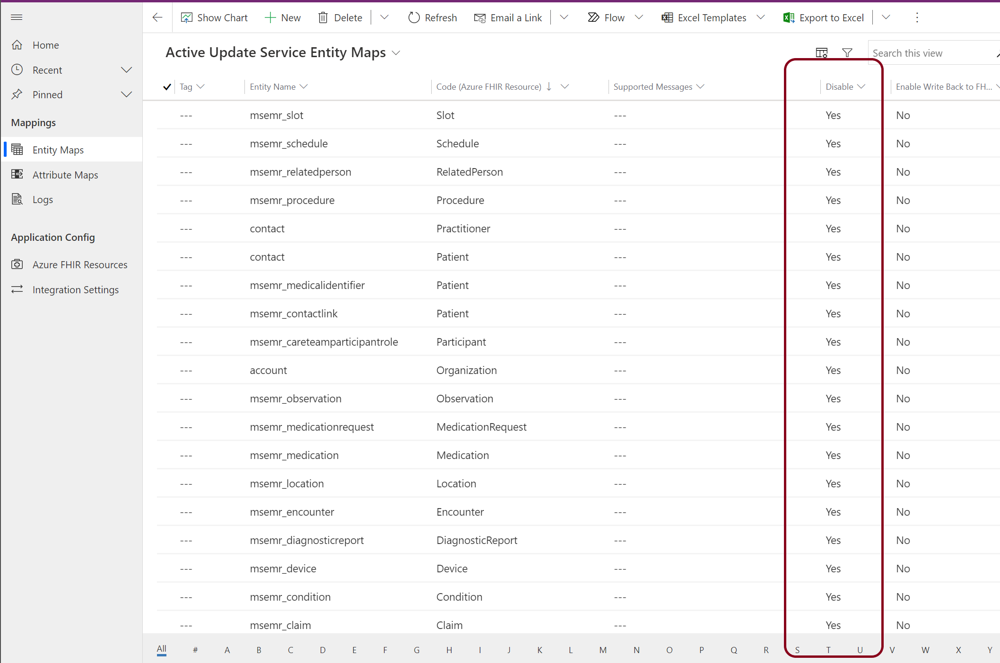
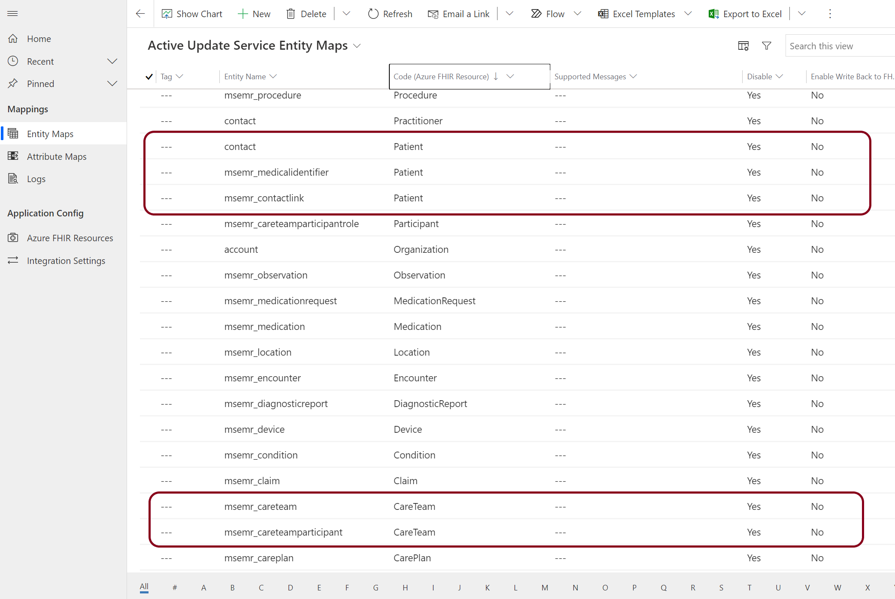
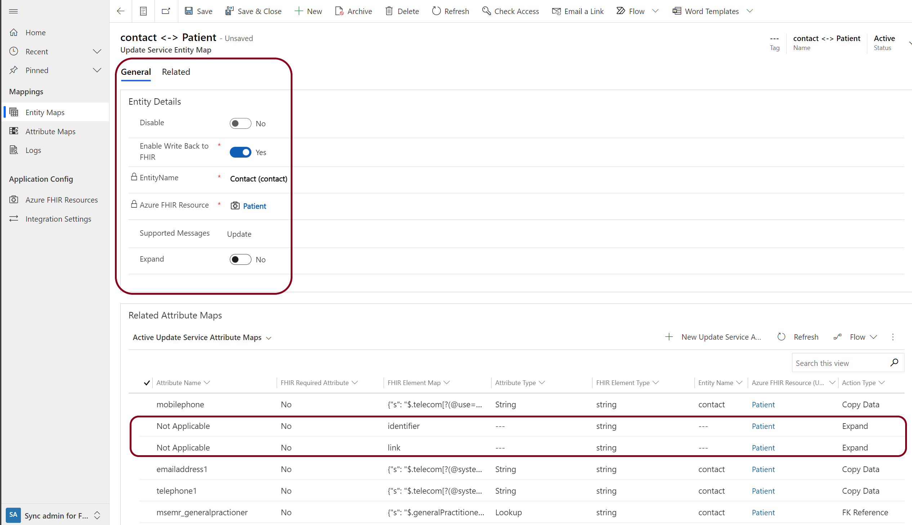
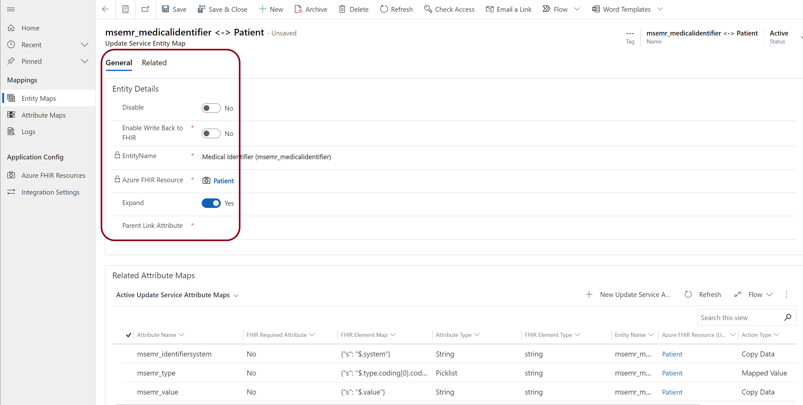
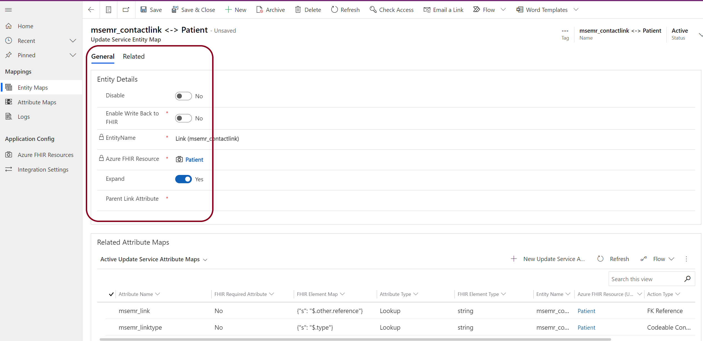

#  Challenge 7 - Dataverse Writing data

## Introduction

Welcome to Challenge 7!

In this challenge you will learn about writing data to and from Azure API for FHIR and Dataverse. 

## Background
Microsoft's Cloud for Healthcare healthcare data store is **Azure API for FHIR**, while leveraging the **Dynamics** Industry data model for health.  Synchronizing data between these two data models requires several layers of mapping, most of which is setup, managed and controlled via the SyncAdmin for FHIR Page in Dynamics. 

## Learning Objectives
+ Synchronizing data between Azure API for FHIR and Dynamics  

## Prerequisites
+ Successful completion of Challenge 1 
+ Successful completion of Challenge 5
+ Successful completion of Challenge 6

---

## Step 1 - Configure Mapping on both Azure and Dynamics 

To begin, all Entity Maps are Disabled by default.  Customers must enable the ones equating to the FHIR Resources they wish to Sync with Dataverse. 

Entity Expansion Maps

Entinty expansion maps have been added for Appointment, Patient, and CareTeam

Enable Patient 

Save & Close when finished.  

__Note__  the expansion Attribute Maps are shown below 

Enable Patient -> Identifier Map

Enable Patient -> Link Map

**Restart the SyncApp to pickup Dynamics Changes**

