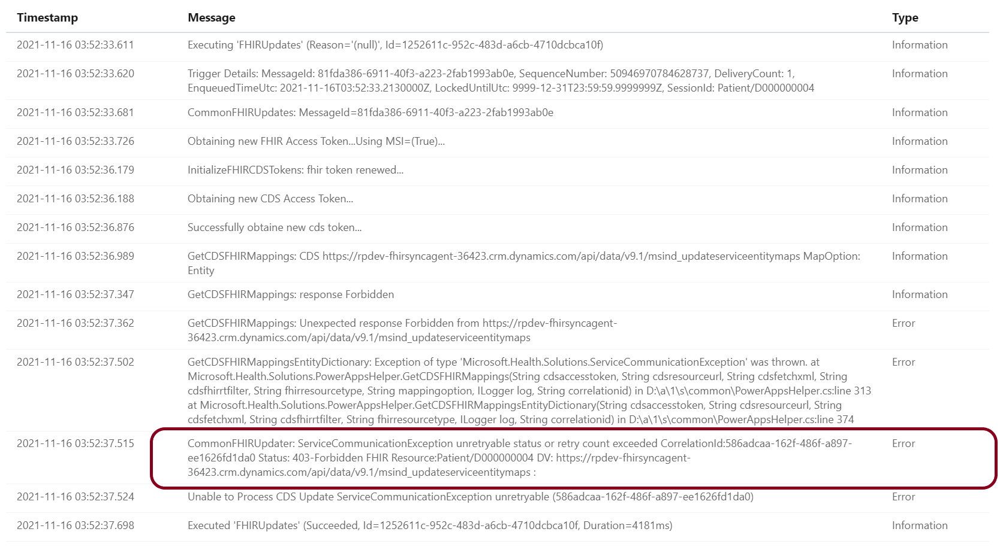

#  Challenge 8 - Debugging, Operations and Maintenance

## Introduction

Welcome to Challenge 8!

In this challenge you will learn to recoginize and address some of the issues that can happen with MC4H.  

## Background
Microsoft's Cloud for Healthcare healthcare data store is **Azure API for FHIR**, while leveraging the **Dynamics** Industry data model for health.  Synchronizing data between these two data models requires several layers of mapping, most of which is setup, managed and controlled via the SyncAdmin for FHIR Page in Dynamics. 

## Learning Objectives
+ Recognize and address some of the more common issues with integrating Azure and Dynamics  

## Prerequisites
+ Successful completion of Challenge 1 
+ Successful completion of Challenge 5
+ Successful completion of Challenge 6
+ Successful completion of Challenge 7

---

## Step 1 - Enable Send and Receive Logging 
As noted in the SyncAgent Deployment Readme.md there is a setting in the Application Configuration file will enable greater logging detail.  

FHIR-SyncAgent Optional Application Settings - __NOT__ included in the setup scripts at this time - they will be added automatically to the seetings in the next release. 
  

Name                                       | Value                      | Located 
-------------------------------------------|----------------------------|--------------------
AzureWebJobs.FHIRNDJsonFileLoader.Disabled | 1                          | Disables the bootstrap Loader  
SA-LOGREQRESP                              | True                       | Additional logging 

Once Enabled, you will be able to view detailed logging information at Function App -> Functions -> Monitor

## Step 2 - Understanding the Messages 
Note the 403-Forbidden response from CDS in the picture below.  This tells us that the application ID we are using is un-authorized to write to CDS (ie Dataverse)

Solution:  Contact your Dataverse administrator and have them update the Sync Agent Client ID for write access to DV **[link](https://docs.microsoft.com/en-us/dynamics365/industry/healthcare/configure-sync-clinical-data#update-integration-settings)** 
  

**Q:** Why does the monitor show Success even though there is an error in the file?  

**A**  Technically the connection was a success, we sent a package and received a reply, therefore the communication is deemed successful even through it may not have included the result you wanted. 

